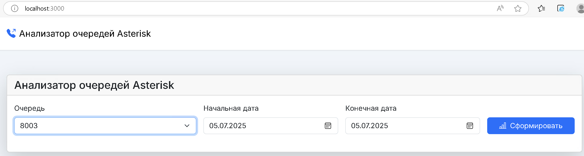
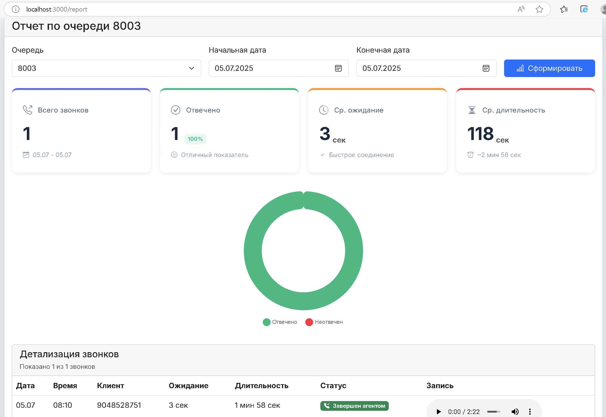

# 📊 Asterisk Queue Analytics

Профессиональное веб-приложение для анализа статистики очередей Asterisk с отслеживанием перезвонов, детальной аналитикой и email-отчетами.


## 📸 Скриншоты

> **Примечание**: Для добавления скриншотов создайте файлы `screen/screen1.png` и `screen/screen2.png`

### Главная страница - Dashboard статистики

*Dashboard с ключевыми метриками (Всего звонков, Процент ответа, Пропущенные, SLA), дополнительными метриками (Перезвоны, Временные показатели) и графиком распределения звонков по часам*

### Детальный лог звонков

*Таблица со всеми звонками с возможностью прослушивания записей, поиска, фильтрации и пагинации. Показывает статусы звонков (Принят, Не отвечен, Занято) и длительность разговоров*

## 🚀 Основные возможности

### 📈 Статистика колл-центра
- **Общая статистика**: Всего звонков, процент ответа, SLA (20 сек)
- **Пропущенные звонки**: Детальная аналитика с разбивкой по перезвонам
- **Временные метрики**: Среднее ожидание, время разговора, время в очереди
- **Профессиональные метрики**: ASA (Average Speed of Answer), Abandon Rate

### 🔄 Отслеживание перезвонов
- **Перезвонил сам**: Автоматическое определение, когда клиент перезвонил после пропущенного звонка
- **Перезвонили мы**: Отслеживание перезвонов от агентов к клиентам
- **Не обработан**: Пропущенные звонки без перезвонов

### 📊 Визуализация данных
- **Почасовая статистика**: Интерактивный график распределения звонков по часам
- **Тренды**: Сравнение показателей с предыдущим периодом
- **Детальная таблица**: Полный лог звонков с пагинацией, поиском и сортировкой

### 🎵 Воспроизведение записей
- Встроенный аудио-плеер для прослушивания записей разговоров
- Поддержка различных форматов аудио

### 📧 Email-отчеты
- Автоматическая ежедневная отправка отчетов по email
- Настройка получателей для каждой очереди отдельно
- HTML-формат отчетов с детальной статистикой

### 🔍 Фильтрация и анализ
- **По очередям**: Детальная статистика по каждой очереди
- **Входящие звонки**: Анализ всех входящих звонков (от длинных номеров к коротким)
- **Исходящие звонки**: Анализ всех исходящих звонков (от коротких номеров к длинным)

## 📋 Требования

- **Node.js**: 14.0 или выше
- **MySQL/MariaDB**: База данных Asterisk (asteriskcdrdb)
- **Доступ к таблицам**: 
  - `asteriskcdrdb.cdr` - детальная информация о звонках
  - `asteriskcdrdb.queuelog` - логи очередей

## 🔧 Установка

### 1. Клонирование репозитория

```bash
git clone https://github.com/maerty1/asterisk-stats.git
cd asterisk-stats
```

### 2. Установка зависимостей

```bash
npm install
```

### 3. Настройка конфигурации

Скопируйте файл `.env.example` в `.env` и заполните параметры:

```bash
cp .env.example .env
```

Отредактируйте `.env` файл:

```env
# ==========================================
# Database Configuration
# ==========================================
DB_HOST=localhost
DB_USER=freepbxuser
DB_PASS=your_password_here
DB_NAME=asterisk
DB_CONNECTION_LIMIT=20

# ==========================================
# Database Adapter Selection
# ==========================================
# Доступные адаптеры: mysql2, sequelize, knex, objection, bookshelf, typeorm, prisma
# По умолчанию: mysql2
DB_ADAPTER=mysql2

# ==========================================
# Outbound Calls Filter Configuration
# ==========================================
# Минимальная длина номера для определения исходящих звонков
# Исходящие = короткий src (<= OUTBOUND_MIN_LENGTH) -> длинный dst (> OUTBOUND_MIN_LENGTH)
OUTBOUND_MIN_LENGTH=4

# ==========================================
# Email Configuration (для ежедневных отчетов)
# ==========================================
SMTP_HOST=smtp.gmail.com
SMTP_PORT=587
SMTP_SECURE=false
SMTP_USER=your_email@gmail.com
SMTP_PASS=your_app_password_here
EMAIL_RECIPIENTS=recipient1@example.com,recipient2@example.com
EMAIL_FROM_NAME=Asterisk Analytics
EMAIL_CRON_SCHEDULE=59 23 * * *
TZ=Europe/Moscow

# ==========================================
# Server Configuration
# ==========================================
PORT=3000

# ==========================================
# Debug Configuration
# ==========================================
DEBUG=false

# ==========================================
# Recordings Path (опционально)
# ==========================================
RECORDINGS_PATH=/var/spool/asterisk/monitor
```

### 4. Создание таблицы для email-отчетов

При первом запуске приложение автоматически создаст таблицу `asteriskcdrdb.email_reports` для хранения настроек email-отчетов.

### 5. Запуск приложения

**Производственный режим:**
```bash
npm start
```

**Режим разработки (с автоперезагрузкой):**
```bash
npm run dev
```

Приложение будет доступно по адресу: `http://localhost:3000`

### 6. Выбор коннектора базы данных (опционально)

Приложение поддерживает различные ORM и коннекторы для работы с базой данных. По умолчанию используется `mysql2`.

**Доступные адаптеры:**
- **mysql2** (по умолчанию) - нативный MySQL драйвер с поддержкой промисов
- **sequelize** - популярный ORM для Node.js
- **knex** - SQL query builder
- **objection** - ORM основанный на Knex
- **bookshelf** - ORM основанный на Knex
- **typeorm** - ORM для TypeScript/JavaScript
- **prisma** - современный ORM с type safety

**Как выбрать адаптер:**

Установите переменную окружения `DB_ADAPTER` в файле `.env`:

```env
DB_ADAPTER=sequelize
```

**Установка зависимостей:**

Все зависимости для адаптеров уже включены в `package.json`. При необходимости установите конкретные пакеты:

```bash
# Для Sequelize
npm install sequelize

# Для Knex
npm install knex

# Для Objection
npm install objection knex

# Для Bookshelf
npm install bookshelf knex

# Для TypeORM
npm install typeorm mysql2 reflect-metadata

# Для Prisma (требует schema.prisma)
npm install @prisma/client prisma
npx prisma generate
```

**Примечания:**
- `mysql2` рекомендуется для максимальной производительности
- `Prisma` требует настройки `schema.prisma` файла
- `TypeORM` лучше работает с TypeScript, но поддерживает JavaScript
- Все адаптеры поддерживают одинаковый API через систему адаптеров

## 📖 Использование

### Статистика по очередям

1. Выберите вкладку **"По очередям"**
2. Выберите очередь из выпадающего списка
3. Укажите диапазон дат (начало и конец периода)
4. Нажмите **"Выполнить анализ"**

Или используйте быстрые фильтры:
- **Сегодня**
- **Вчера**
- **Неделя**
- **Месяц**

### Входящие звонки

1. Выберите вкладку **"Входящие"**
2. Укажите диапазон дат
3. Нажмите **"Выполнить анализ"**

Система покажет все входящие звонки (от длинных номеров к коротким) с детальной статистикой.

### Исходящие звонки

1. Выберите вкладку **"Исходящие"**
2. Укажите диапазон дат
3. Нажмите **"Выполнить анализ"**

Система покажет все исходящие звонки (от коротких номеров к длинным) с детальной статистикой.

### Экспорт данных

Нажмите кнопку **"Экспорт"** для скачивания данных в формате CSV.

### Настройка email-отчетов

1. Нажмите кнопку **"Настройки email"**
2. Выберите очередь
3. Введите email-адрес получателя
4. Нажмите **"Добавить"**

Отчеты будут автоматически отправляться согласно расписанию, указанному в `.env` (по умолчанию каждый день в 23:59).

## 🗂️ Структура проекта

```
asterisk-stats/
├── app.js                 # Главный файл сервера (Express)
├── helpers.js            # Вспомогательные функции
├── email-service.js      # Сервис отправки email-отчетов
├── logger.js             # Настройка логирования
├── package.json          # Зависимости проекта
├── .env.example          # Пример конфигурации
├── views/                # EJS шаблоны
│   ├── index.ejs        # Главная страница
│   └── error.ejs        # Страница ошибок
├── public/               # Статические файлы
│   ├── css/
│   │   └── style.css    # Стили Material Design 3
│   └── js/
│       ├── chart.js     # Логика графиков и таблиц
│       └── status-monitor.js  # Мониторинг статуса
├── screen/               # Скриншоты для документации
│   ├── screen1.png      # Главная страница
│   └── screen2.png      # Детальный лог
└── .env                  # Конфигурация (не в git)
```

## 🔍 Детали реализации

### Отслеживание перезвонов

Система автоматически определяет перезвоны для пропущенных звонков:

- **Перезвонил сам**: Клиент перезвонил в течение 2 часов после пропущенного звонка
  - Проверяется в таблице `cdr` по номеру клиента
  - Исключаются исходящие звонки (dcontext не содержит 'outbound', 'from-internal', 'ext-local')
  
- **Перезвонили мы**: Агент перезвонил клиенту в течение 2 часов после пропущенного звонка
  - Проверяется в таблице `queuelog` по номеру клиента
  - Ищется успешный звонок от агента к клиенту
  
- **Не обработан**: Пропущенные звонки без перезвонов
  - Вычисляется как: `Пропущенные - Перезвонил сам - Перезвонили мы`

### Определение типа звонка

**Входящие звонки:**
- `LENGTH(TRIM(src)) > OUTBOUND_MIN_LENGTH` (длинный номер)
- `LENGTH(TRIM(dst)) <= OUTBOUND_MIN_LENGTH` (короткий номер)

**Исходящие звонки:**
- `LENGTH(TRIM(src)) <= OUTBOUND_MIN_LENGTH` (короткий номер)
- `LENGTH(TRIM(dst)) > OUTBOUND_MIN_LENGTH` (длинный номер)
- ИЛИ `LENGTH(outbound_cnum) >= 4` (поле outbound_cnum заполнено)

### Оптимизация производительности

- **Connection Pooling**: Использование пула соединений MySQL для эффективной работы с БД
- **Batch Processing**: Групповая обработка перезвонов для уменьшения количества запросов
- **Compression**: Gzip сжатие ответов сервера
- **Кэширование**: Кэширование списка очередей

## 🛠️ Технологии

- **Backend**: 
  - Node.js 14+
  - Express.js 4.x
  - MySQL2 (с connection pooling)
  - Nodemailer (для email-отчетов)
  - Node-cron (для планирования задач)
  
- **Frontend**: 
  - EJS (шаблонизатор)
  - Material Design 3 (дизайн-система)
  - SVG графики (Chart.js)
  - Vanilla JavaScript (ES6+)
  
- **База данных**: 
  - MySQL/MariaDB
  - Таблицы: `cdr`, `queuelog`, `email_reports`

## 🔒 Безопасность

- Использование переменных окружения для конфиденциальных данных
- Защита от SQL-инъекций (prepared statements)
- Rate limiting для API endpoints
- Helmet.js для защиты HTTP заголовков
- Валидация входных данных

## 📝 Лицензия

MIT License - см. файл [LICENSE](LICENSE) для деталей.

## 👤 Автор

**maerty1**

- GitHub: [@maerty1](https://github.com/maerty1)

## 🤝 Вклад в проект

Приветствуются Pull Requests! Для больших изменений сначала откройте Issue для обсуждения.

### Как внести вклад:

1. Fork проекта
2. Создайте ветку для новой функции (`git checkout -b feature/AmazingFeature`)
3. Закоммитьте изменения (`git commit -m 'Add some AmazingFeature'`)
4. Push в ветку (`git push origin feature/AmazingFeature`)
5. Откройте Pull Request

## 🐛 Известные проблемы

Если вы обнаружили баг, пожалуйста, создайте Issue с описанием проблемы.

## 📞 Поддержка

Если у вас есть вопросы или нужна помощь, создайте Issue в репозитории.

## 🔄 История изменений

### v1.0.0 (Текущая версия)
- ✅ Полная статистика по очередям
- ✅ Отслеживание перезвонов (клиент и агент)
- ✅ Анализ входящих и исходящих звонков
- ✅ Email-отчеты с настройкой получателей
- ✅ Dashboard с ключевыми метриками
- ✅ Детальный лог звонков с поиском и фильтрацией
- ✅ Воспроизведение записей разговоров
- ✅ Экспорт данных в CSV
- ✅ Material Design 3 интерфейс

---

⭐ Если проект был полезен, поставьте звезду!
